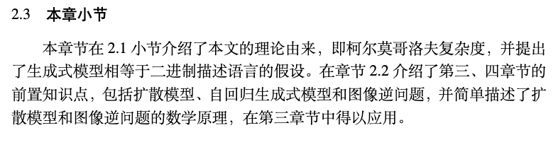
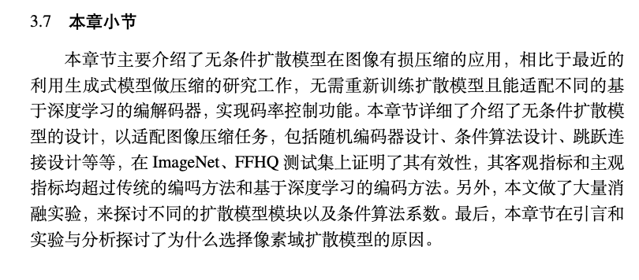
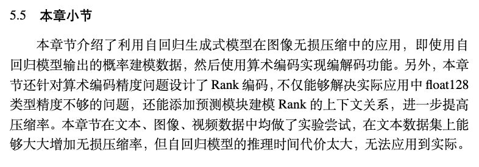
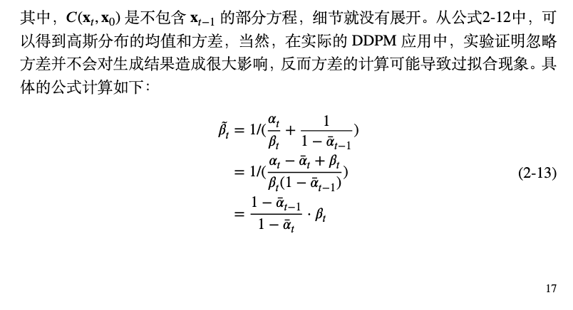
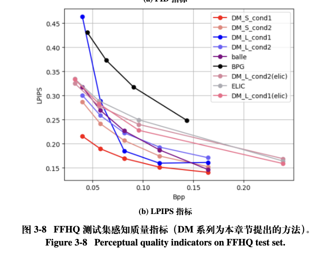
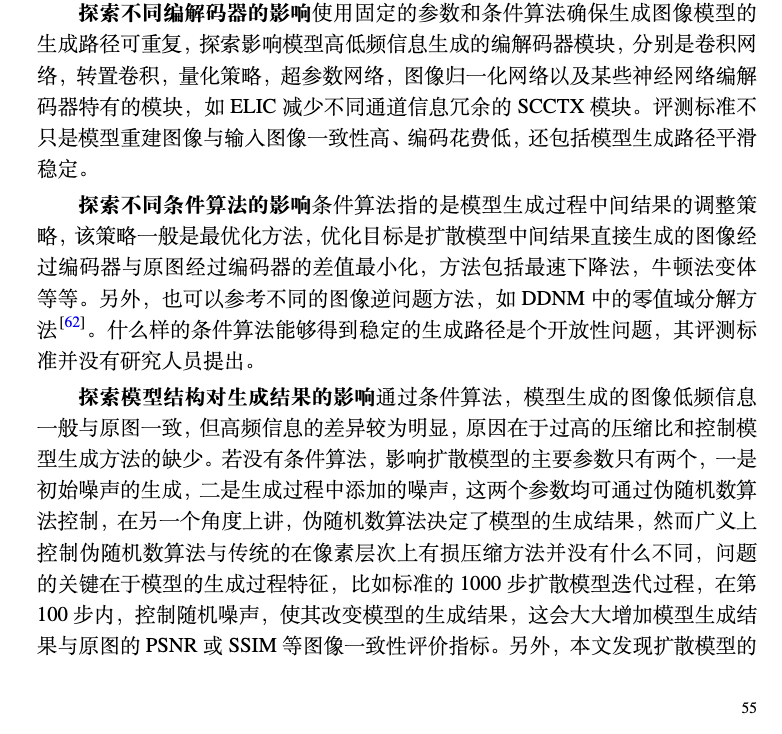

# 对毕业论文修改意见的回复
### 1. 论文prematter中的符号表
符号表是正文前的一页，我不知道计算机专业的毕业论文是否需要，按照预答辩老师的意见，我将该页直接去除。

### 2. 在每一章增加小结
除了展望章节，我已添加小节。
- 第二章节小节如下：

- 第三章节小节如下：

- 第四章节小节如下：

注：5.5章节是因为我还没调整文章结构，但内容一致。

### 3. latex模版在页尾的空白问题
我已调整第17页的公式，如下图所示：

### 4. 实验结果图片本文方法标注问题
我在图例标题中加了注释，而英文并没有添加括号中的内容。

### 5. 展望章节paragraph间隔过大问题
已解决：

### 6. 第三章节中拆分引言
在引言部分将模型整体架构拆分为独立一章

### 7. 章节变更：变分视角下的编码器
预答辩老师认为该章节过短，建议去除。

该章节的内容主要是第三章方法的改进，因为实验结果不好的原因，我并没有展示实验，因此，我讲该章节的方法放入展望部分。

需要变更的地方
- abstract
- 绪论中的章节安排

### 8. 章节扩写：基于自回归大语言模型的无损压缩
添加内容包括：模型结构、算术编码、和一些实验分析

### 9. 章节连贯性问题
各章节题目改为：
- 论文题目：基于无条件生成式模型的图像压缩研究
- 第三章节题目：基于无条件扩散模型的有损图像压缩
- 第四章节题目：基于自回归大语言模型的无损压缩

原来第三章节的题目为基于无条件扩散模型在解码端的应用。
